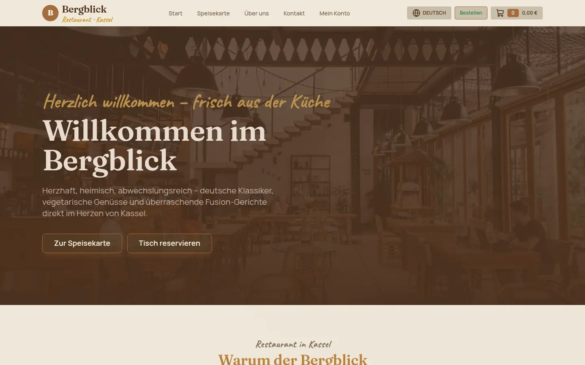
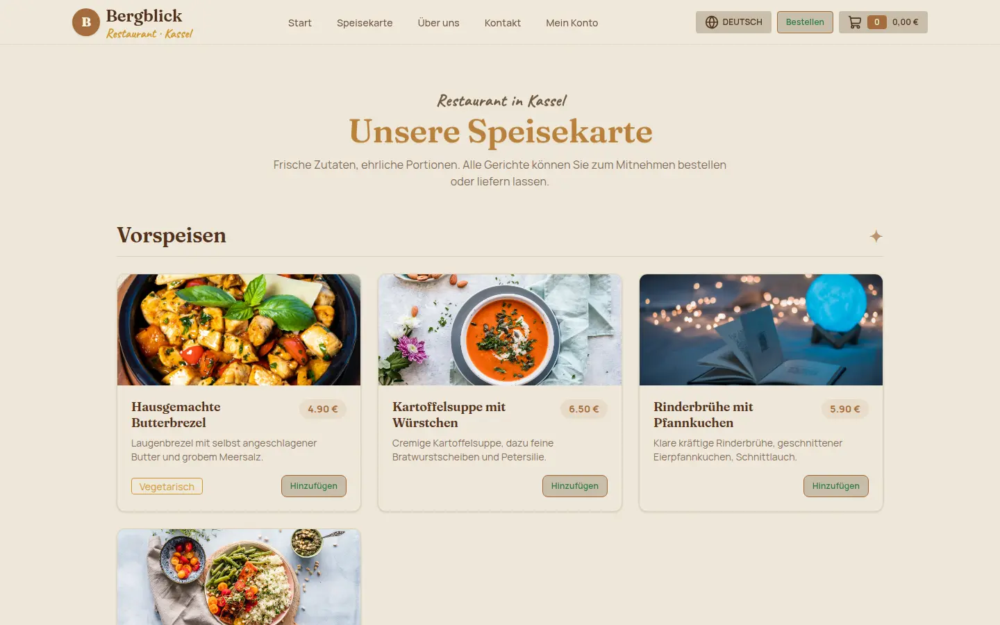
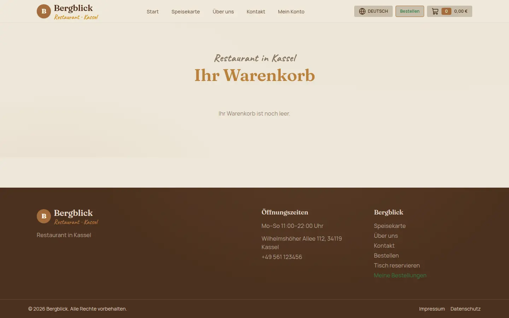
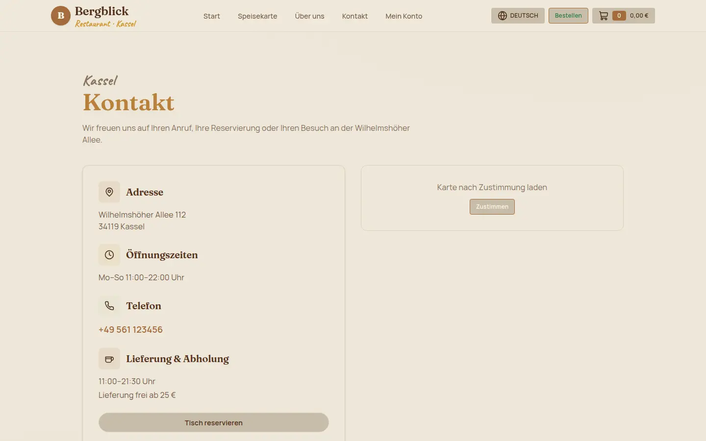
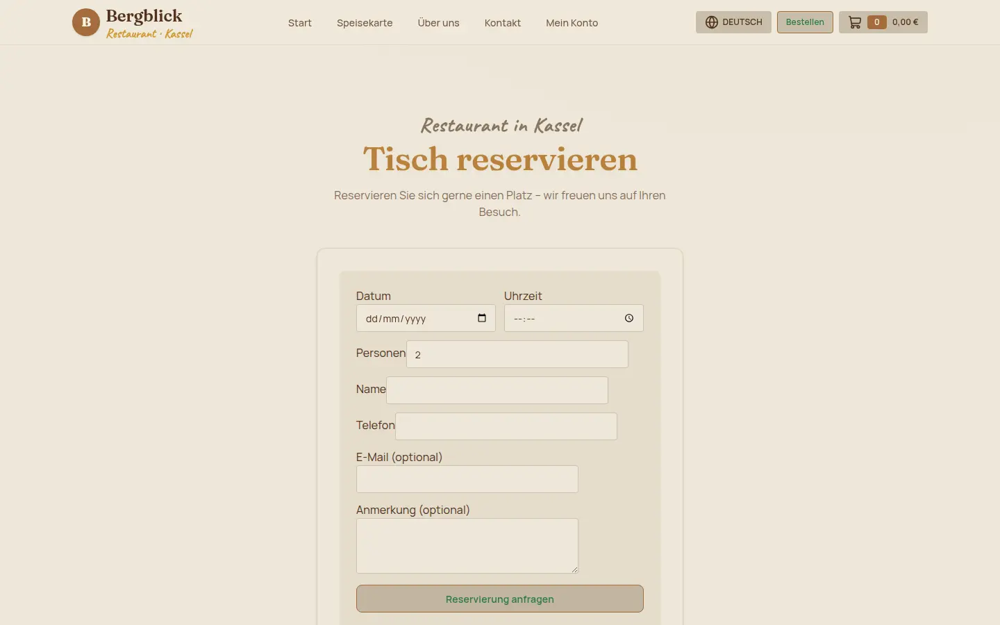
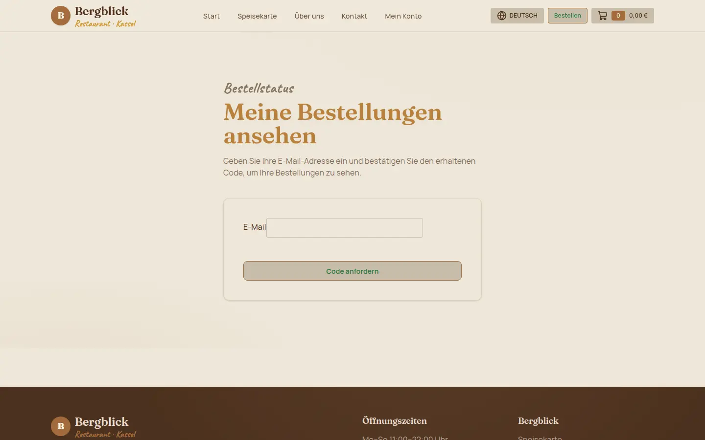
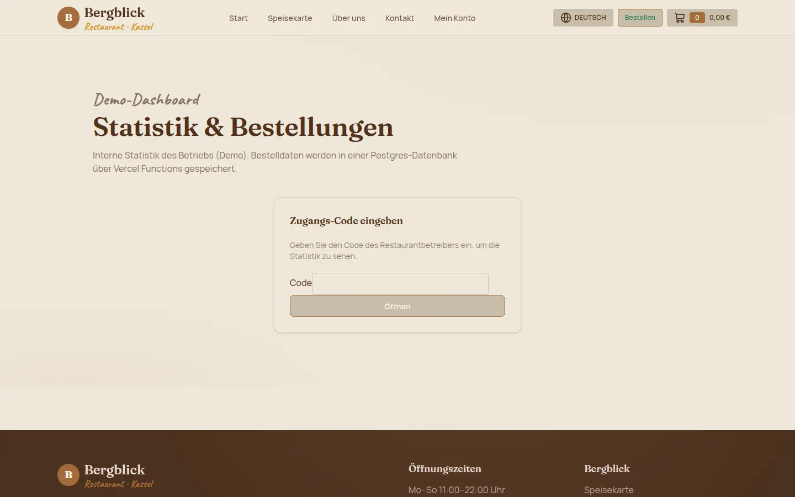
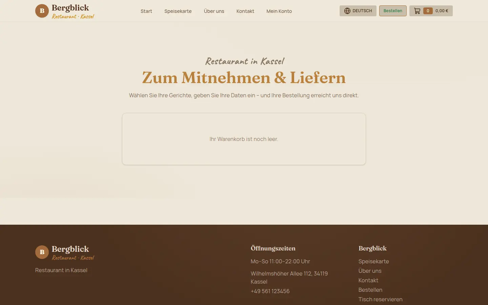

# Bergblick Restaurant – Website

> **Учебный проект** (training project). Сайт вымышленного кафе-ресторана «Bergblick» в Касселе (Германия) с системой заказа «на вынос / доставка», панелью статистики и парольным доступом к заказам. Контент и брони — сгенерированные/демо, реальных броней и оплат нет.



---

## Содержание

- [О проекте](#о-проекте)
- [Возможности](#возможности)
- [Стек](#стек)
- [Скриншоты](#скриншоты)
- [Структура проекта](#структура-проекта)
- [Запуск](#запуск)
- [Переменные окружения](#переменные-окружения)
- [Режимы работы (demo vs production)](#режимы-работы-demo-vs-production)
- [База данных и API](#база-данных-и-api)
- [Локализация](#локализация)
- [Как устроена корзина](#как-устроена-корзина)
- [Авторизация и безопасность](#авторизация-и-безопасность)
- [Что можно докрутить в будущем](#что-можно-докрутить-в-будущем)
- [Документация проекта](#документация-проекта)

---

## О проекте

Многоязычный (DE / RU / EN) сайт ресторана со статичными маркетинговыми страницами и интерактивным заказом еды на вынос/доставку. Построен как **учебный full-stack** пример: статическая генерация + островки React (`islands`), корзина и состояние на клиенте, серверные serverless-функции (Vercel Functions) для заказов, статистики и passwordless-входа «Мои заказы».

Сайт занимает **3 языка на одной инсталляции** с префиксом локали (`/de/`, `/ru/`, `/en/`), тёплой «деревянной» темой (daisyUI `mytheme`) и cartridge-UI на Tailwind 4.

## Возможности

- **Маркетинговые страницы**: главная (hero с анимированным акцентом, преимущества, превью меню, карта/контакты), «О нас», «Меню», «Контакт», резерв столиков.
- **Трёхязычный интерфейс** (`de`, `ru`, `en`) с переключателем.
- **Заказ еды**:
  - корзина на клиенте (`nanostores` + `localStorage`);
  - выделенная страница `/cart/` с выбором **Abholung (самовывоз) / Lieferung (доставка)**;
  - расчёт доставки (бесплатно от 25 €, иначе 3,50 €);
  - отправка заказа на сервер → запись в PostgreSQL + уведомление в Telegram.
- **Панель статистики** `/admin/` — оборот сегодня/всего, средний чек, заказы по дням, бестселлеры, последние заказы (защищена кодом владельца).
- **«Мои заказы»** `/track/` — passwordless-доступ по коду на e-mail (в demo код показывается на экране).
- **Cookie-consent** для карты (OpenStreetMap iframe).
- **Юридические страницы**: Impressum, Datenschutz.

## Стек

| Область       | Технология                              |
| :------------ | :-------------------------------------- |
| Framework     | [Astro](https://astro.build) 5–7 (SSG)  |
| Язык          | TypeScript (strict)                     |
| UI-островки   | React 19 (islands)                      |
| Состояние     | Nanostores + `@nanostores/react`        |
| Стили         | Tailwind CSS 4 + daisyUI 5 (`mytheme`)  |
| Анимации      | `motion`, кастомные CSS-эффекты (Magnet, ScrollReveal, GradientText, Noise) |
| Backend       | Vercel Functions (`api/`) + `@vercel/postgres` |
| База данных   | Vercel Postgres                         |
| Тесты         | Vitest                                  |
| Иконки        | `lucide-react`                          |

## Скриншоты

| Главная | Меню | Корзина и доставка |
| :---: | :---: | :---: |
|  |  |  |

| Страница «Контакт» с картой | Резерв столика | Мои заказы (passwordless) |
| :---: | :---: | :---: |
|  |  |  |

| Панель статистики (demo) | Страница «На вынос» |
| :---: | :---: |
|  |  |

Скриншоты помещаются в `screenshots/`. Чтобы пересоздать их (нужен Chrome):

```sh
npx astro preview &        # Chrome headless клонит страницы
google-chrome --headless=new --window-size=1440,900 --virtual-time-budget=6000 \
  --screenshot="screenshots/home.png" http://localhost:4321/de/
# затем cwebp/convert -> webp
```

## Структура проекта

```text
.
├── api/                      # Serverless-функции (Vercel)
│   ├── _telegram.ts          #   серверная отправка уведомлений в Telegram
│   ├── orders.ts             #   POST (создать заказ) / GET (список, admin)
│   ├── stats.ts              #   агрегаты: оборот, средний чек, бестселлеры
│   ├── my-orders.ts          #   заказы по e-mail (по токену)
│   └── auth/
│       ├── request-code.ts   #   запрос 6-значного кода для e-mail
│       └── verify.ts         #   проверка кода -> подписанный токен (HMAC)
├── src/
│   ├── components/
│   │   ├── cart/             # корзина: AddToCartButton, CartPage, OrderForm…
│   │   ├── effects/          # Magnet, ScrollReveal, GradientText, Noise
│   │   ├── layout/           # Nav, Footer
│   │   ├── sections/         # Hero, Highlights, MenuPreview…
│   │   ├── tracks/admin/…    # MyOrders, StatsDashboard
│   │   └── ReservationForm, LocationMap
│   ├── content/menus.ts      # меню (блюда, цены, переводы на 3 языка)
│   ├── i18n/                 # словари de/ru/en + типы
│   ├── lib/                  # чистая логика: cartStore, takeaway, config, menu
│   ├── pages/                # маршруты (см. ниже)
│   ├── stores/               # nanostores: cart, consent
│   ├── layouts/BaseLayout.astro
│   └── styles/global.css     # тема mytheme (daisyUI) + кастомные анимации
├── screenshots/              # изображения для README
├── docs/                     # SDD-документация (spec, adr, tickets, retrospective)
├── astro.config.mjs
└── package.json
```

### Маршруты (`src/pages`)

| Путь | Описание |
| :--- | :--- |
| `/` → `/de/`, `/ru/`, `/en/` | Главная (локали с префиксом) |
| `/[locale]/menu/` | Полное меню по категориям |
| `/[locale]/cart/` | Корзина + оформление (выбор самовывоз/доставка) |
| `/[locale]/takeaway/` | Страница «На вынос» |
| `/[locale]/reservation/` | Резерв столика |
| `/[locale]/contact/` | Контакты + карта (OpenStreetMap) |
| `/[locale]/about/` | О нас |
| `/[locale]/legal/impressum` · `datenschutz` | Юридические страницы |
| `/track/` | «Мои заказы» (passwordless) |
| `/admin/` | Панель статистики (demo: открыта; prod: код владельца) |

## Запуск

```bash
npm install        # установка зависимостей
npm run dev        # dev-сервер на http://localhost:4321
npm test           # vitest
npm run check      # astro check (TS + типы)
npm run build      # test + check + astro build -> dist/
npm run preview    # превью собранного dist/
```

Требуется **Node >= 22.12.0**.

## Переменные окружения

Файл `.env` (не коммитится). Все переменные — **серверные** (устанавливаются в окружении Vercel Functions), никаких `PUBLIC_*` секретов в клиентском бандле нет.

| Переменная | Обязательность | Назначение |
| :--- | :--- | :--- |
| `POSTGRES_URL` | по желанию (см. demo) | строка подключения к Vercel Postgres |
| `AUTH_TOKEN_SECRET` | **обязателен** для `verify` / `my-orders` | секрет для подписи токенов «Мои заказы» (HMAC-SHA256). Без него функции кидают ошибку на старте |
| `ADMIN_CODE` | по желанию | код владельца для панели `/admin/`. Пока не задан — панель остаётся открытой (demo) |
| `TELEGRAM_BOT_TOKEN` | по желанию | токен бота для уведомлений о заказах |
| `TELEGRAM_CHAT_ID` | по желанию | чат, куда слать уведомления |

> Важно: `AUTH_TOKEN_SECRET` и секреты Telegram **не должны** иметь fallback-значений в коде. Если функция запущена без них — она падает с явной ошибкой, а не использует слабый дефолт.

## Режимы работы (demo vs production)

Сайт — учебный, поэтому многие интеграции имеют «демо»-фолбэк:

| Условие | Поведение |
| :--- | :--- |
| `POSTGRES_URL` не задан | `POST /api/orders` отвечает `{ id: 'demo', persisted: false }`; заказ всё равно уходит в Telegram; `GET /orders` и `/stats` возвращают пустые данные |
| `ADMIN_CODE` не задан | `/admin/` и `GET /api/orders` открыты без кода (удобно для демонстрации) |
| `ADMIN_CODE` задан | дашборд требует ввод кода владельца (`x-admin-code`), неверный → 403 |
| `request-code` без БД | возвращает демо-код `123456` прямо в ответ |
| `verify` без БД | принимает любой 6-значный код, выдаёт подписанный токен |
| Без кодового email-провайдера | код показывается на экране в `/track/` («Demo-Code») |

Для «настоящей» (prod) работы задай `POSTGRES_URL`, `AUTH_TOKEN_SECRET`, `ADMIN_CODE` и укажи телеграм-бот.

## База данных и API

Одна таблица `orders` (схема создаётся идемпотентно через `ORDERS_DDL`):

```text
id uuid PK, created_at timestamptz, email, name, phone,
pickup_time, note, total_cents int, free_delivery bool,
items jsonb
```

Схема вынесена в общую константу `api/orders.ts`, которую переиспользуют `orders`, `stats`, `my-orders` (без дублирования DDL).

- `POST /api/orders` — создаёт заказ: валидирует поля, пишет в БД, затем **на сервере** отправляет уведомление в Telegram (`api/_telegram.ts`). Клиент не трогает бота — секрет токена не попадает в бандл.
- `GET /api/orders?limit=N` — последние заказы (admin-доступ при `ADMIN_CODE`).
- `GET /api/stats` — агрегаты на стороне БД (`sum`, `filter where created_at >= day`, `jsonb_to_recordset` для бестселлеров).
- `POST /api/auth/request-code` · `POST /api/auth/verify` — passwordless-вход.
- `GET /api/my-orders` — заказы по e-mail по подписанному токену.

## Локализация

- Словари: `src/i18n/{de,ru,en}.ts`, типизированы через `Dictionary` (`src/i18n/types.ts`) — добавление ключа без перевода на всех языках ловится на этапе сборки.
- Меню: `src/content/menus.ts` — каждый текст (название/описание) это `{ de, ru, en }`.
- Роутинг Astro i18n с `prefixDefaultLocale: true` → `/de/`, `/ru/`, `/en/`.
- Язык страницы задаёт `lang` и тему `data-theme`.

## Как устроена корзина

- Состояние: атом `cartItems` в `src/stores/cart.ts`, персист в `localStorage`. Подписка на запись регистрируется **ровно один раз** (`initCart`), а не на каждый вызов компонента.
- Чистая логика reducers/селекторов: `src/lib/cartStore.ts` (`addItem`, `setQuantity`, `removeItem`, `cartTotal`, `cartCount`) — единый источник правды. Компоненты используют селекторы (`cartTotalValue`, `cartCountValue`), избегая ручного `reduce`.
- Сборка заказа и расчёт доставки: `src/lib/takeaway.ts` (покрыта unittest-ами `takeaway.test.ts`).
- `CartController` (иконка в шапке) — просто ссылка на `/cart/` с реактивным бейджем количества и суммой.

## Авторизация и безопасность

- **Без fallback-секретов**: `AUTH_TOKEN_SECRET` обязателен для функций с токенами; отсутствие → ошибка при старте функции.
- **Telegram только на сервере**: бот-токен и chat-id читаются из `process.env` в `api/_telegram.ts`; он никогда не экспортируется клиенту.
- **Подпись токенов**: HMAC-SHA256 (`crypto`) с `timingSafeEqual` для сравнения сигнатур.
- **Admin-гейт**: в prod `ADMIN_CODE` обязателен для `/api/stats` и `GET /api/orders`.
- `x-admin-code`/токен — это **секрет, вводимый владельцем**, а не полноценная сессия. Для учебного проекта достаточно; в проде нужен настоящий auth (см. «Что можно докрутить»).

## Что можно докрутить в будущем

Идеи по порядку приоритета (учебные и практические):

**Бизнес/UX**
- [ ] Настоящее резервирование: запись в БД + подтверждение (сейчас форма просто показывает «успех»).
- [ ] Сквозной checkout: адрес доставки, способы оплаты (в учебном режиме — sandbox), подтверждение e-mail.
- [ ] История заказов в аккаунте клиента + отмена/повтор заказа.
- [ ] Информация о дог-френдли/доставке, часы разных локаций, время ожидания.

**Backend / данные**
- [ ] Миграции схемы (вместо `create table if not exists` на каждый запрос).
- [ ] Настоящий email-провайдер для кодов «Мои заказы» (сейчас код выводится на экран в demo).
- [ ] Аутентификация владельца через сессию/token (серверный), а не секрет в заголовке.
- [ ] Rate-limiting на `request-code` и `verify` (защита от перебора кода), анти-спам.
- [ ] Валидация на сервере серверной стороны (цены/итоги), чтобы клиент не мог подменить суммы.
- [ ] Сбор и мониторинг ошибок (структурированный лог/обсервер).

**Frontend / качество**
- [ ] Реальные unit/E2E-тесты на React-интерфейсы (сейчас тестируется только чистая логика `takeaway`).
- [ ] Accessibility: цвета контраст, `prefers-reduced-motion`, полные `aria`-атрибуты (частично есть).
- [ ] Инфраструктура: большую часть интерфейса переплети на клиентских островках, но часть страниц остаётся статичной — держать баланс TTI.
- [ ] SEO-мета, Open Graph, изображение-превью, `sitemap.xml`, `robots.txt`.
- [ ] Оптимизация изображений (Astro Image), уменьшение бандла иконок (tree-shaking `lucide`).

**Инфраструктура / процессы**
- [ ] CI на GitHub Actions: `npm run build` + lint на каждый PR, деплой по тегу.
- [ ] Preview-деплой веток (Vercel Preview) для проверки перед merge.
- [ ] Скриншот-тесты (Playwright) против макетов.

## Документация проекта

Проект ведётся по облегчённому SDD-процессу. Документация в `docs/`:

- `docs/sdd/spec.md` — техзадание;
- `docs/sdd/tickets/*.md` — вертикальные срезы работы;
- `docs/adr/` — решения по архитектуре;
- `docs/sdd/retrospective.md` — ретроспектива проекта.

Контекст/глоссарий — `CONTEXT.md`. Авторы и правила для агента — `AGENTS.md`.

---

*Проект выполнен в образовательных целях. Все названия, контент, цены и «заказы» — вымышленные.*